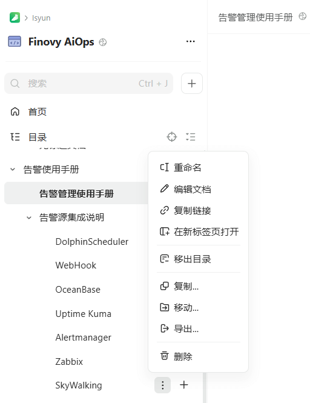
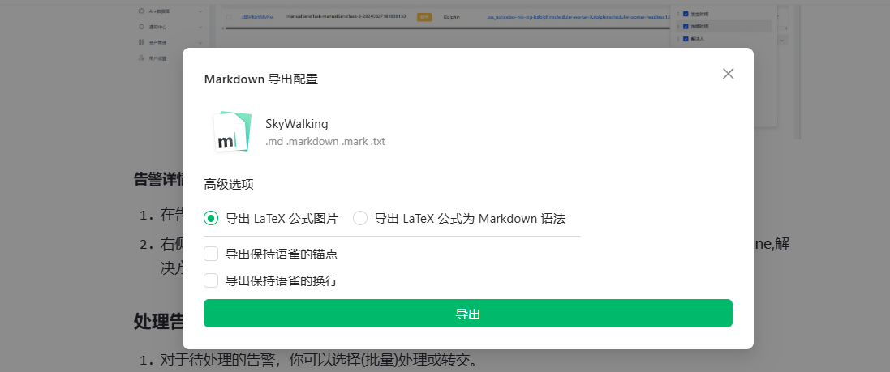
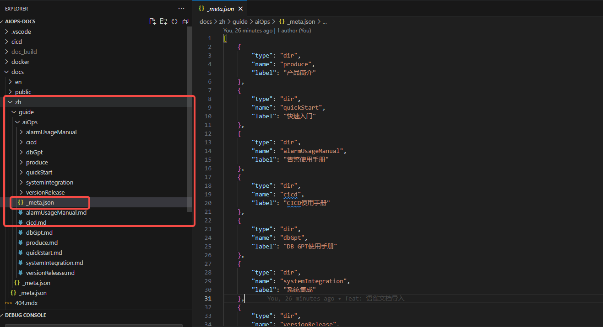
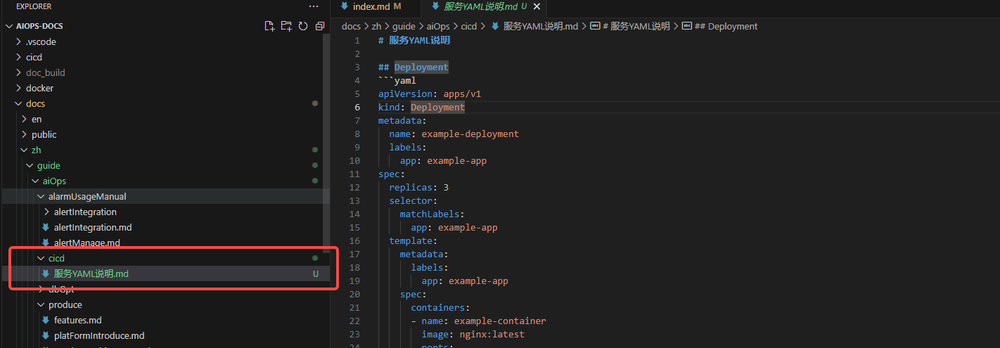
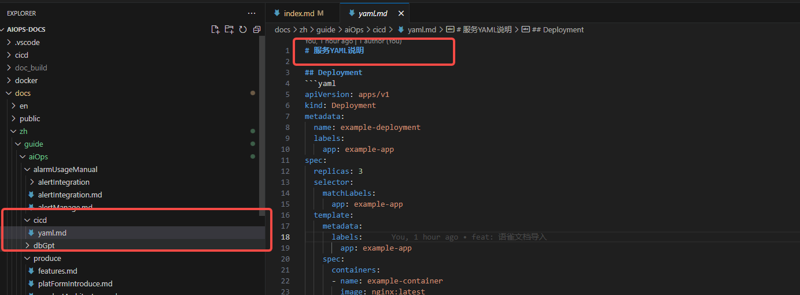
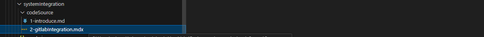

# AiOps文档系统

## 从语雀导入文档步骤

### 第一步：文档导出


选择选项1或者2进行导出，得到md格式的文件


### 第二步： 新增目录(如有需要)
如果侧边导航栏需要新开目录，则在_meta.json文件下按顺序添加对应类型即可


### 第三步： 拖拽粘贴
将步骤1导出的文档拖动粘贴到对应的目录


修改成对应的英文名称(统一规范使用英文)，并添加一级标题名称，其他不变


### 第四步： 排序(如有需要)
框架自动生成的侧边栏默认按照文件名的字母顺序排序。如果你想要自定义顺序，可以在文件名前加上数字前缀


#### 提示
如果想要点击侧边栏目录显示某篇文档，你可以在当前目录同级创建一个同名的 `md(x)` 文件，比如：

```bash
docs
├── produce.md
└── produce
  ├── _meta.json
  └── ...
```

这样，当你点击 `produce` 目录时，会显示 `produce.md` 文件的内容。


注意： 侧边栏目录/文件新增之后可能需要重启dev才能看到最新效果。

更多配置用法请参考 [Rspress配置-自动化导航栏/侧边栏](https://rspress.dev/zh/guide/basic/auto-nav-sidebar)

