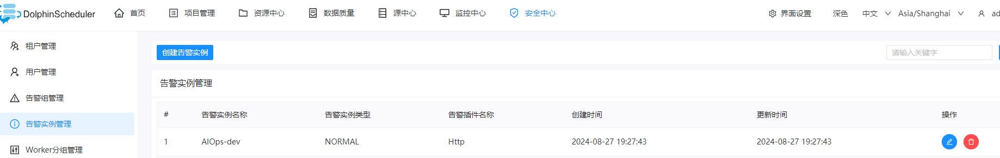
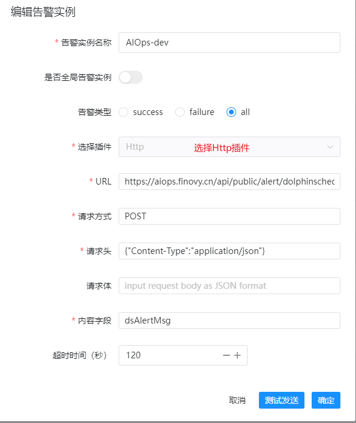

# DolphinScheduler
> DolphinScheduler 是一个分布式的易扩展的可视化数据工作流调度系统，旨在解决复杂的任务依赖管理与任务调度问题。它是由Apache孵化并成为顶级项目的一个开源项目，主要用于大数据领域中复杂的数据处理任务的调度和自动化。
>

## 配置步骤
在资产管理-告警源集成 添加WebHook应用， 填写应用名称，开启相关配置后，点击保存生成appKey及URL地址 https://aiops.finovy.cn/api/public/alert/dolphinscheduler/ { appKey }

1.安全中心-告警实例管理 下创建告警实例

2.如下图配置告警信息

## 说明信息
监控级别对应关系

| 严重 | SERIOUS |
| --- | --- |
| 警告 | MIDDLE |

