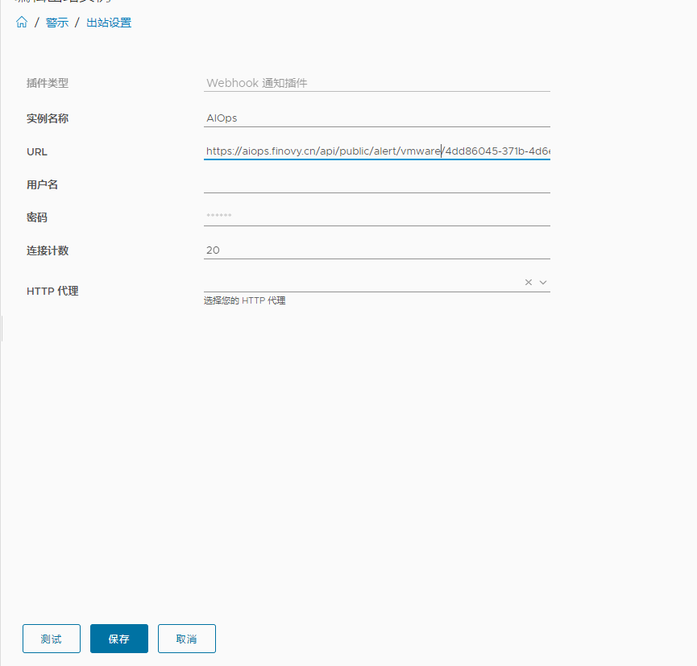
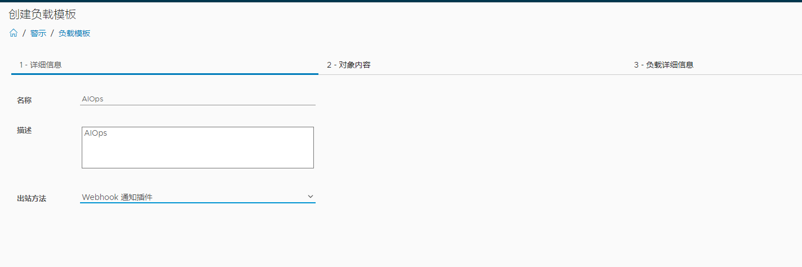
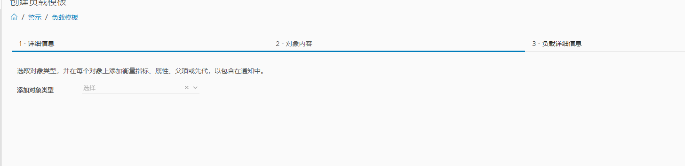
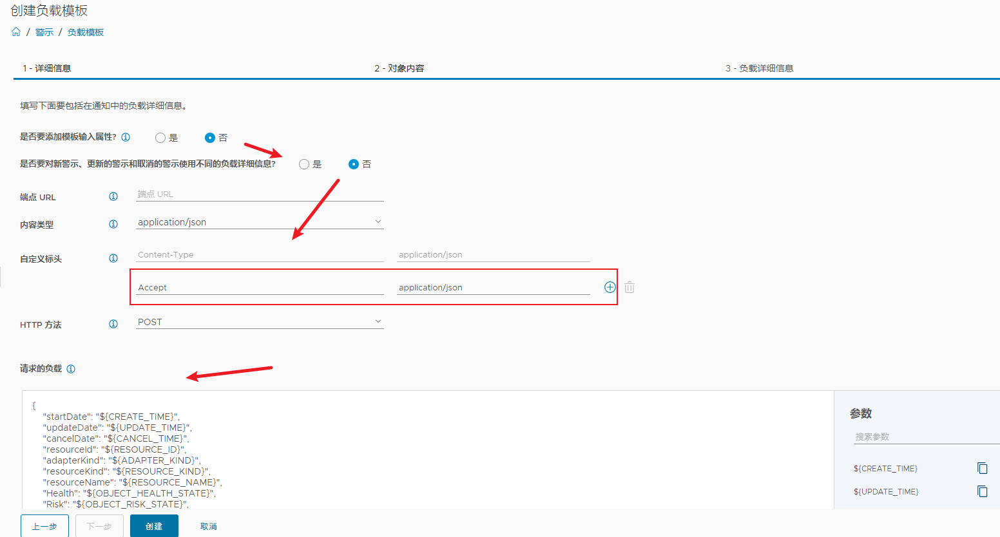
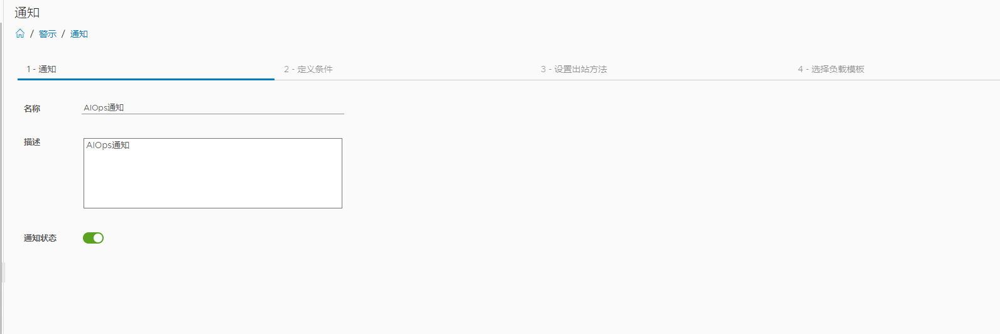
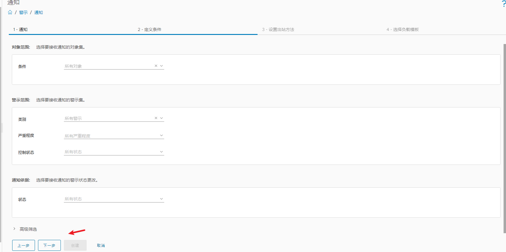
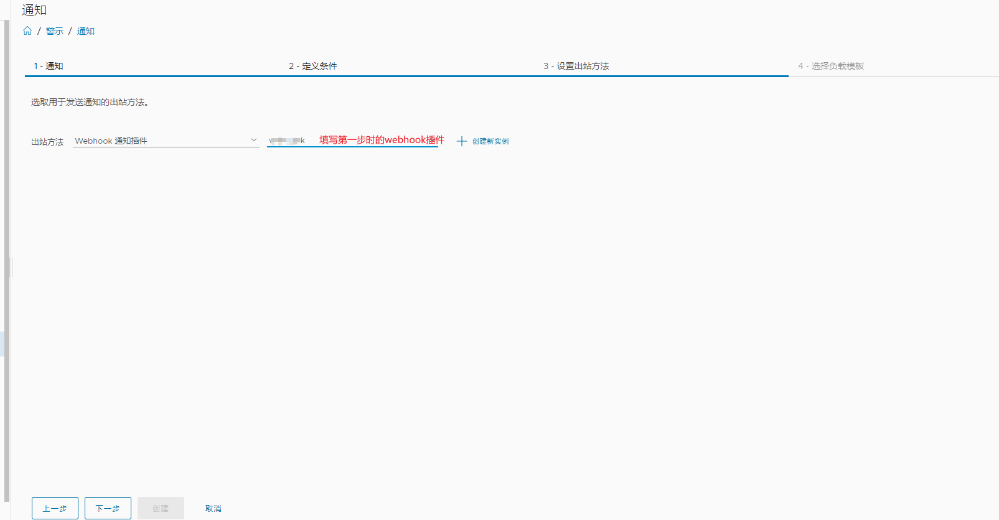
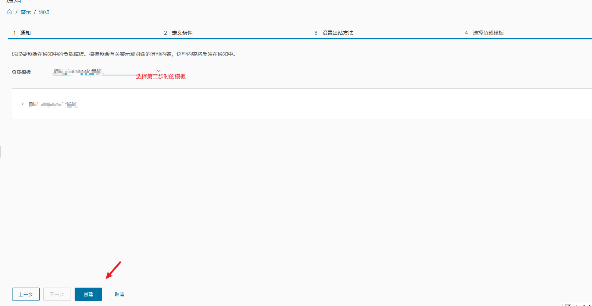

# VMware
vRealize Operations 是 VMware 提供的一个监控和管理平台，专注于虚拟化和云环境的性能、容量和故障管理。它帮助企业在整个 IT 基础架构（包括虚拟化、物理、云）中实现高效管理。vRealize Operations 的核心功能包括：

1. 性能监控：实时监控虚拟机、主机、存储、网络等资源的性能，提供详细的分析报告和性能数据。
2. 容量规划：分析当前资源的使用情况，提供预测和优化建议，以便更好地规划资源扩展。
3. 警示和通知：通过设置阈值和策略，当系统资源出现瓶颈或异常时，vROps 会自动生成警示，并且可以通过 webhook 或邮件等方式通知管理员。
4. 智能运维：利用机器学习算法，vROps 能识别环境中的异常趋势，提供预测分析和主动维护建议。

## 配置步骤
一：在配置-警示-出站设置 添加WebHook：[https://aiops.finovy.cn/api/public/alert/vmware/{appKey}](https://aiops.finovy.cn/api/public/alert/vmware/{appKey})



二：在配置-警示-负载模板 添加模板：



直接下一步





请求的负载如下：

```json
{
    "startDate": "${CREATE_TIME}",
    "updateDate": "${UPDATE_TIME}",
    "cancelDate": "${CANCEL_TIME}",
    "resourceId": "${RESOURCE_ID}",
    "adapterKind": "${ADAPTER_KIND}",
    "resourceKind": "${RESOURCE_KIND}",
    "resourceName": "${RESOURCE_NAME}",
    "Health": "${OBJECT_HEALTH_STATE}",
    "Risk": "${OBJECT_RISK_STATE}",
    "Efficiency": "${OBJECT_EFFICIENCY_STATE}",
    "impact": "${ALERT_IMPACT}",
    "criticality": "${ALERT_CRITICALITY}",
    "alertName": "${ALERT_DEFINITION}",
    "type": "${ALERT_TYPE}",
    "subType": "${ALERT_SUBTYPE}",
    "alertId": "${ALERT_ID}",
    "status": "${ALERT_STATUS}",
    "recommendations": "${ALERT_RECOMMENDATIONS}",
    "alertURL": "${LINK_TO_ALERT}",
    "alertNoticeHost": "${HOST_NAME}",
    "symptom": "${SYMPTOMS}"
}
```

三：在配置-警示-通知 添加通知：









## 说明信息
监控级别对应关系

| <font style="color:#000000;">致命</font> | <font style="color:#000000;">critical</font> |
| --- | --- |
| 严重 | immediate |
| 警告 | <font style="color:#000000;">warn</font> |
| <font style="color:#000000;">提醒、通知</font> | <font style="color:#000000;">info</font> |


