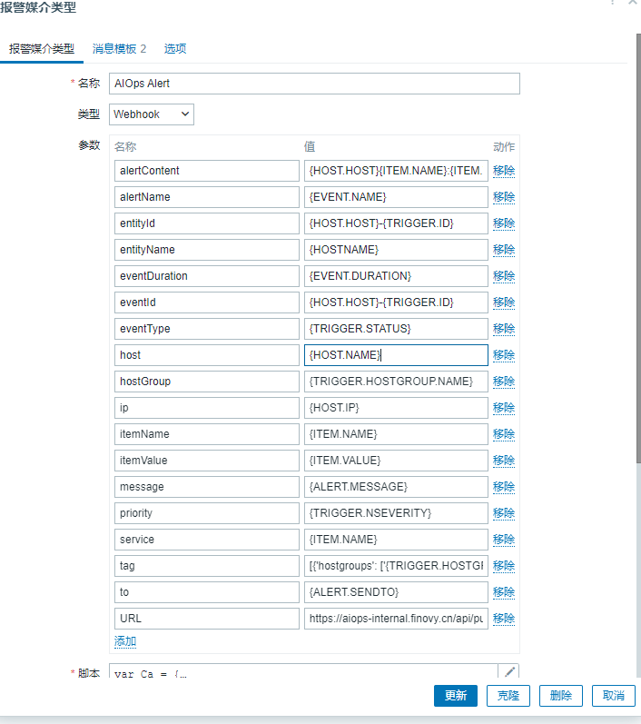
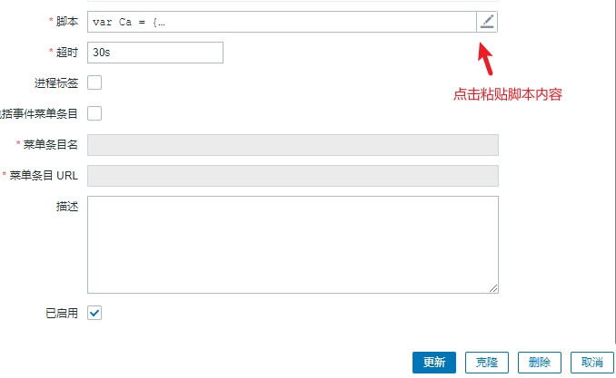
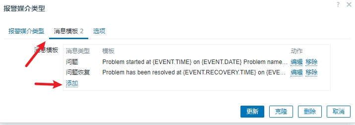
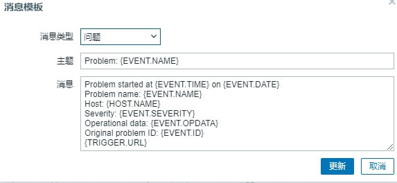
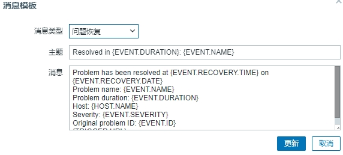
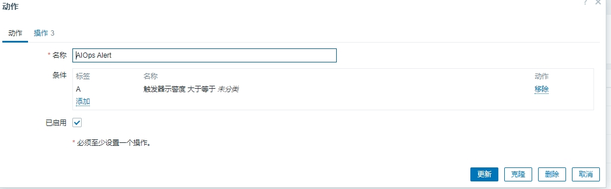
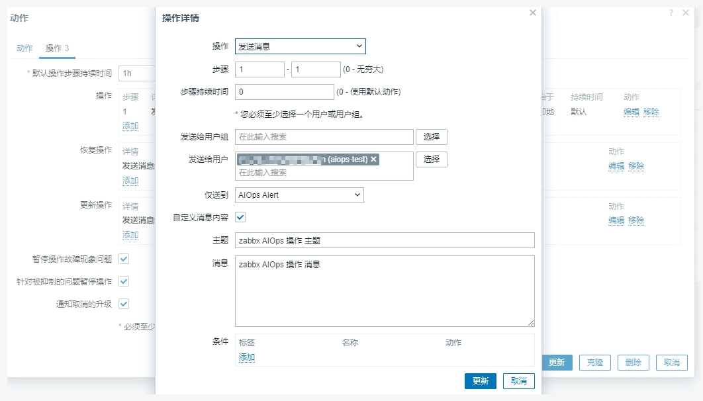
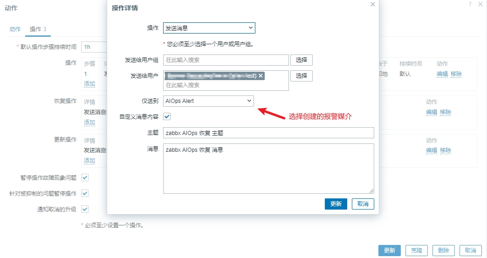
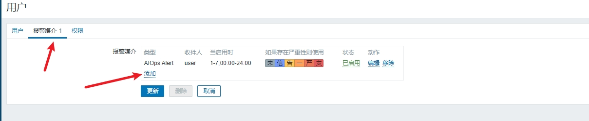
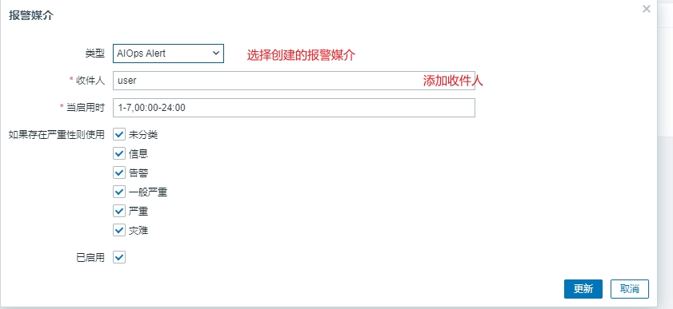

# Zabbix
> Zabbix 提供了一个网络和应用监控的开源解决方案，它支持数百万的监控指标。
>
> 安装 Zabbix 应用可以将 Zabbix 中的告警接入到 AI Ops 中来，自动帮您压缩冗余告警，避免告警风暴，让您更快定位和解决问题。
>

## 配置步骤
### 一、 webhook配置方式链接
<font style="color:rgb(29, 33, 41);">1、填写应用名称，点击保存生成AppKey</font>

<font style="color:rgb(29, 33, 41);">2、webhook配置方式</font>

<font style="color:rgb(29, 33, 41);">在Zabbix 的 告警 - 媒介 - 创建媒介类型</font>



<font style="color:rgb(29, 33, 41);">3、添加参数</font>

| <font style="color:rgb(29, 33, 41);">名称</font> | <font style="color:rgb(29, 33, 41);">值</font> |
| :--- | :--- |
| <font style="color:rgb(29, 33, 41);">URL</font> | <font style="color:rgb(29, 33, 41);">填写WebHook地址，</font>[https://aiops.finovy.cn/api/public/alert/zabbix/](https://aiops.finovy.cn/api/public/alert/zabbix/)<font style="color:rgb(29, 33, 41);"> { appKey }</font> |
| <font style="color:rgb(29, 33, 41);">alertContent</font> | <font style="color:rgb(29, 33, 41);">{HOST.HOST}-{ITEM.NAME}:{ITEM.VALUE}-{TRIGGER.NAME}</font> |
| <font style="color:rgb(29, 33, 41);">alertName</font> | <font style="color:rgb(29, 33, 41);">{EVENT.NAME}</font> |
| <font style="color:rgb(29, 33, 41);">entityId</font> | <font style="color:rgb(29, 33, 41);">{HOST.HOST}-{TRIGGER.ID}</font> |
| <font style="color:rgb(29, 33, 41);">entityName</font> | <font style="color:rgb(29, 33, 41);">{HOSTNAME}</font> |
| <font style="color:rgb(29, 33, 41);">eventDuration </font> | <font style="color:rgb(29, 33, 41);">{EVENT.DURATION}</font> |
| <font style="color:rgb(29, 33, 41);">eventId</font> | <font style="color:rgb(29, 33, 41);">{HOST.HOST}-{TRIGGER.ID}</font> |
| <font style="color:rgb(29, 33, 41);">eventType</font> | <font style="color:rgb(29, 33, 41);">{TRIGGER.STATUS}</font> |
| <font style="color:rgb(29, 33, 41);">host</font> | <font style="color:rgb(29, 33, 41);">{HOST.NAME}</font> |
| <font style="color:rgb(29, 33, 41);">hostGroup</font> | <font style="color:rgb(51, 51, 51);">{TRIGGER.HOSTGROUP.NAME}</font> |
| <font style="color:rgb(29, 33, 41);">ip</font> | <font style="color:rgb(29, 33, 41);">{HOST.IP}</font> |
| <font style="color:rgb(29, 33, 41);">itemName</font> | <font style="color:rgb(29, 33, 41);">{ITEM.NAME}</font> |
| <font style="color:rgb(29, 33, 41);">itemValue</font> | <font style="color:rgb(29, 33, 41);">{ITEM.VALUE}</font> |
| <font style="color:rgb(29, 33, 41);">message</font> | <font style="color:rgb(29, 33, 41);">{ALERT.MESSAGE}</font> |
| <font style="color:rgb(29, 33, 41);">priority</font> | <font style="color:rgb(29, 33, 41);">{TRIGGER.NSEVERITY}</font> |
| <font style="color:rgb(29, 33, 41);">service</font> | <font style="color:rgb(29, 33, 41);">{ITEM.NAME}</font> |
| <font style="color:rgb(29, 33, 41);">tag</font> | <font style="color:rgb(29, 33, 41);">[{'hostgroups': ['{TRIGGER.HOSTGROUP.NAME}']}]</font> |
| <font style="color:rgb(29, 33, 41);">to</font> | <font style="color:rgb(29, 33, 41);">{ALERT.SENDTO}</font> |


<font style="color:rgb(29, 33, 41);">4、添加脚本内容（内容默认，直接添加即可）</font>

<font style="color:rgb(29, 33, 41);">脚本内容</font>

```javascript
var Ca = {
  params: {},
  proxy: null,
  setParams: function (params) {
    if (typeof params !== 'object') {
      return;
    }
    Ca.params = params;
  },
  request: function () {
    var data = {
      message: Ca.params.message,
      to: Ca.params.to,
      eventId: Ca.params.eventId,
      eventType: Ca.params.eventType,
      alertName: Ca.params.alertName,
      entityId: Ca.params.entityId,
      alertContent: Ca.params.alertContent,
      priority: Ca.params.priority,
      host: Ca.params.host,
      tag: Ca.params.tag,
      ip: Ca.params.ip,
      itemName: Ca.params.itemName,
      itemValue: Ca.params.itemValue,
      entityName: Ca.params.entityName,
      service: Ca.params.service,
      eventDuration: Ca.params.eventDuration,
      hostGroup: Ca.params.hostGroup,
    },
      response,
      url = Ca.params.URL,
      request = new HttpRequest();
    request.addHeader('Content-Type: application/json');
    if (typeof Ca.HTTPProxy !== 'undefined' && Ca.HTTPProxy !== '') {
      request.setProxy( Ca.HTTPProxy);
    }
    if (typeof data !== 'undefined') {
      data = JSON.stringify(data);
    }
    response = request.post(url, data);
    if (response !== null) {
      try {
        response = JSON.parse(response);
      }
      catch (error) {
        response = null;
      }
    }
    if (request.getStatus() !== 200 ) {
      var message = 'Request failed with status code '+request.getStatus();
      if (response !== null && typeof response.errmsg !== 'undefined') {
        message += ': '+ JSON.stringify(response.errmsg) ;
      }
      throw message + '. Check debug log for more information.';
    }
    return response;
  },
};
try {
  var params = JSON.parse(value);
  if (typeof params.URL !== 'undefined'
      && typeof params.to !== 'undefined'
      && typeof params.message !== 'undefined') {
  }
  else {
    throw 'Missing parameter. URL, message, to parameter is required'
  }
  if (params.HTTPProxy) {
    Ca.proxy = params.HTTPProxy;
  }
  Ca.setParams(params);
  Ca.request();
  return 'OK';
}catch (error) {
  throw 'Sending failed: ' + error;
}
```

<font style="color:rgb(29, 33, 41);">注意zabbix5.0版本以上，在创建报警类型时还需要添加两个Message templates类型分别为问题、Problem recovery</font>





### <font style="color:rgb(29, 33, 41);">二、 进入 告警-> 动作->触发器动作->创建动作</font>


<font style="color:rgb(29, 33, 41);">1、添加操作（内容默认直接添加即可）</font>

<font style="color:rgb(29, 33, 41);">2、添加恢复操作（内容默认直接添加即可）</font>

### <font style="color:rgb(29, 33, 41);">三、 进入  用户 -> 用户 -> 点击Admin用户</font>




<font style="color:rgb(29, 33, 41);">参考官网连接：</font>[https://www.zabbix.com/documentation/6.4/zh/manual/config/notifications/media/webhook](https://www.zabbix.com/documentation/6.4/zh/manual/config/notifications/media/webhook)

## <font style="color:rgb(29, 33, 41);">说明信息</font>
<font style="color:rgb(29, 33, 41);">监控级别对应关系</font>

| <font style="color:rgb(29, 33, 41);">致命</font> | <font style="color:rgb(29, 33, 41);">5</font> |
| --- | --- |
| <font style="color:rgb(29, 33, 41);">严重</font> | <font style="color:rgb(29, 33, 41);">4</font> |
| <font style="color:rgb(29, 33, 41);">警告</font> | <font style="color:rgb(29, 33, 41);">2,3</font> |
| <font style="color:rgb(29, 33, 41);">提醒</font> | <font style="color:rgb(29, 33, 41);">1</font> |
| <font style="color:rgb(29, 33, 41);">通知</font> | <font style="color:rgb(29, 33, 41);">0</font> |


