# 告警管理使用手册
### <font style="color:rgb(44, 44, 54);">概述</font>
<font style="color:rgb(44, 44, 54);">本手册旨在介绍如何使用智能告警模块下的告警管理功能，包括查看，处理，关闭，转交告警，告警分派策略配置以及告警处理 TimeLine 功能。</font>

### <font style="color:rgb(44, 44, 54);"> 查看告警</font>
#### <font style="color:rgb(44, 44, 54);">告警列表</font>
1. <font style="color:rgb(44, 44, 54);">在我的告警列表中，您可以看到待处理、处理中和已关闭三种类型的告警。</font>


2. <font style="color:rgb(44, 44, 54);">如果你是管理员，在所有告警列表中可以看到未分配类型的告警数据，未分配数据的生成规则是：发生告警后会先走已经建立好的分派策略，如果不符合策略规则，则最后"流放"到未分配类型。</font>


3. 不同的业务团队可能关注的数据字段不同，因此添加了列显示/隐藏以及拖拽排序功能。通过如下图所示按钮图表打开表格列设置菜单，在这里可以选择哪些列应该显示，哪些列应该隐藏，以及可以点击并按住表头，将其拖动到所需的新位置即可完成排序。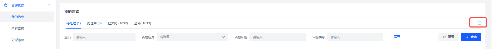

在操作之后，系统会保存你的列显示/隐藏及排序设置，以便下次打开页面时自动恢复到上次的状态。

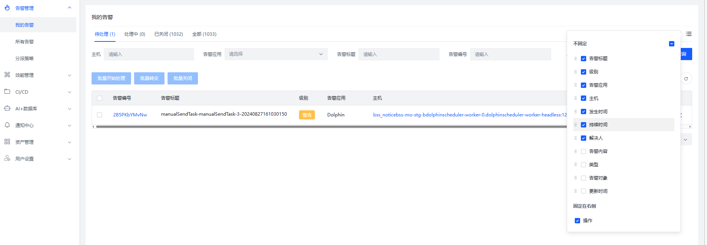

#### <font style="color:rgb(44, 44, 54);">告警详情</font>
1. <font style="color:rgb(44, 44, 54);">在告警列表中点击告警编号。</font>
2. <font style="color:rgb(44, 44, 54);">右侧弹出详情内容，包括基本信息下的告警级别、内容、标题、主机和 IP 地址等，以及TimeLine,解决方案，AI诊断结果(如果有使用过AI诊断功能)等</font>

### <font style="color:rgb(44, 44, 54);">处理告警</font>
1. <font style="color:rgb(44, 44, 54);">对于待处理的告警，你可以选择(批量)处理或转交。</font>
2. <font style="color:rgb(44, 44, 54);">如果你决定处理告警，可以点击开始处理按钮或者勾选后进行批量处理，也可以点开告警详情页面进行操作。</font>
3. <font style="color:rgb(44, 44, 54);">如果你需要转交告警，可以参考下方内容。</font>

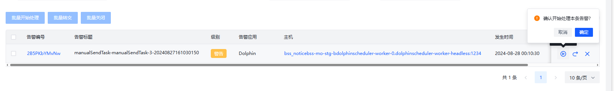

### <font style="color:rgb(44, 44, 54);">转交告警</font>
1. <font style="color:rgb(44, 44, 54);">在告警列表中选择需要转交的告警。</font>
2. <font style="color:rgb(44, 44, 54);">点击“转交”按钮或者勾选后进行批量转交，也可以点开告警详情页面进行操作。</font>
3. <font style="color:rgb(44, 44, 54);">选择转交人员。</font>
4. <font style="color:rgb(44, 44, 54);">输入转交原因(如果需要)。</font>
5. <font style="color:rgb(44, 44, 54);">点击“确定”。</font>

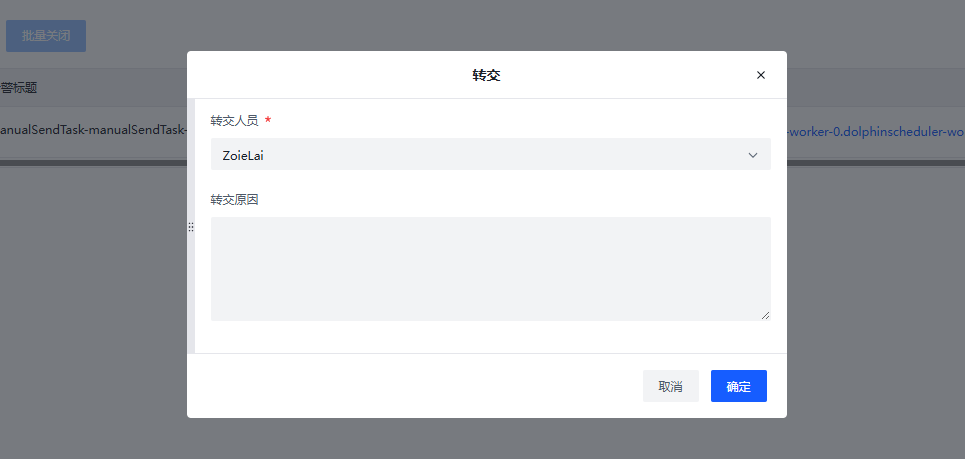

### <font style="color:rgb(44, 44, 54);"> 关闭告警</font>
1. <font style="color:rgb(44, 44, 54);">在告警列表中找到需要关闭的告警。</font>
2. <font style="color:rgb(44, 44, 54);">点击关闭按钮或者勾选后进行批量关闭，也可以点开告警详情页面进行操作。</font>
3. <font style="color:rgb(44, 44, 54);">输入解决方案（如果需要）。</font>
4. <font style="color:rgb(44, 44, 54);">点击“确定”。</font>

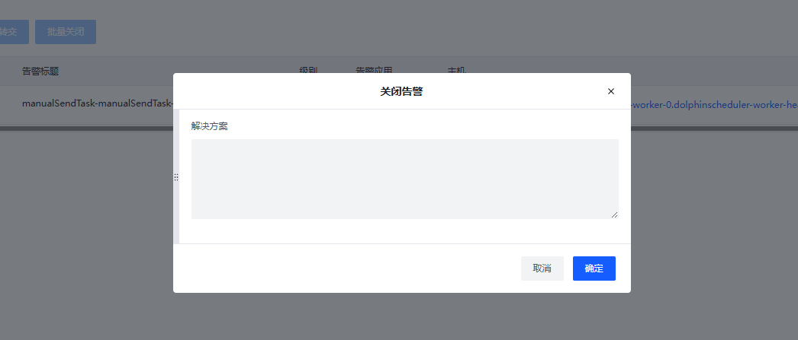

### <font style="color:rgb(44, 44, 54);">告警处理TimLine</font>
#### <font style="color:rgb(44, 44, 54);">查看 TimeLine</font>
1. <font style="color:rgb(44, 44, 54);">查看告警的历史记录和处理过程。</font>

#### <font style="color:rgb(44, 44, 54);"> 编辑 TimeLine</font>
1. <font style="color:rgb(44, 44, 54);">在 TimeLine 中找到需要编辑的步骤。</font>
2. <font style="color:rgb(44, 44, 54);">点击编辑按钮。</font>
3. <font style="color:rgb(44, 44, 54);">输入评论。</font>
4. <font style="color:rgb(44, 44, 54);">点击保存。</font>

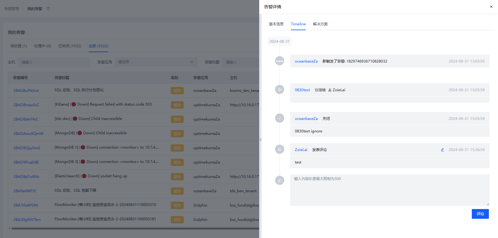

### <font style="color:rgb(44, 44, 54);">查看解决方案</font>
1. <font style="color:rgb(44, 44, 54);">告警关闭后，可以在这里查看告警相关的解决方案。</font>

### AI诊断
这个功能是用于智能分析告警内容，利用AI提供专业的见解或建议。诊断流程如下：

+ 用户点击“AI诊断”按钮
+ 调用后端的AI接口，系统将自动分析用户提交的数据或问题
+ 等待一定时间后，系统返回AI分析的结果并在页面上展示给用户
+ 系统会保留当前询问的结果，下次再点击查看时会直接展示上次诊断的结果，也可以再次点击诊断


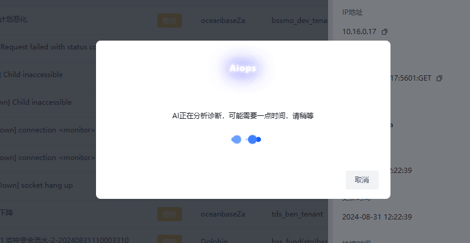

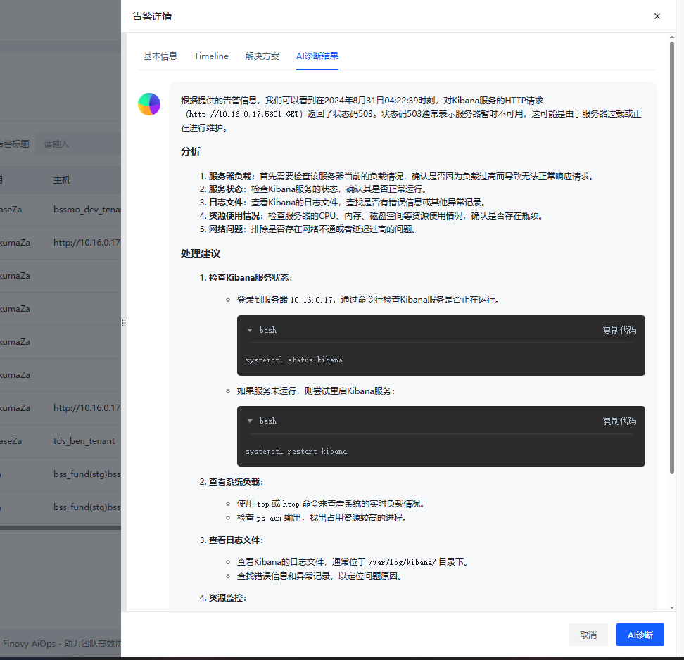

### <font style="color:rgb(44, 44, 54);">告警分派策略</font>
#### 概述
当系统接收到第三方告警时，会根据分派策略预定义的规则将告警信息发送给合适的团队或个人进行处理，它可以提高问告警问题解决速度与效率，减少误报率，并确保关键问题得到优先关注。

#### <font style="color:rgb(44, 44, 54);">新建告警策略</font>
1. <font style="color:rgb(44, 44, 54);">点击“新建”按钮。</font>
2. <font style="color:rgb(44, 44, 54);">填写策略名称和优先级(优先级越高列表顺序越靠前)。</font>
3. <font style="color:rgb(44, 44, 54);">选择应用，设置告警级别、内容、标题、主机和 IP 地址匹配规则。</font>
4. <font style="color:rgb(44, 44, 54);">可选动作行为： 默认选择分派，如选择忽略，则有符合规则的告警会自动关闭。</font>
5. <font style="color:rgb(44, 44, 54);">添加处理人或用户分组。</font>
6. <font style="color:rgb(44, 44, 54);">可选择开启飞书或者邮箱通知，填写对应的必要条件即可。</font>
7. <font style="color:rgb(44, 44, 54);">点击保存。</font>

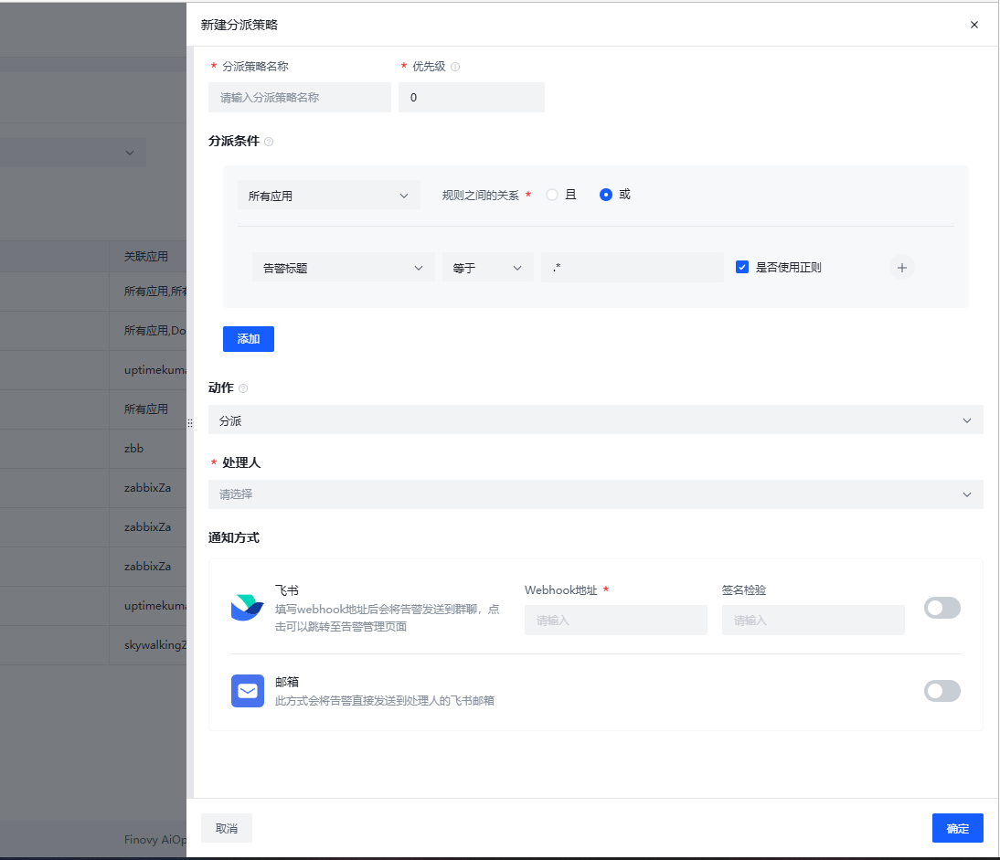

#### <font style="color:rgb(44, 44, 54);">编辑告警策略</font>
1. <font style="color:rgb(44, 44, 54);">告警策略列表页点击策略名称或者点击编辑。</font>
2. <font style="color:rgb(44, 44, 54);">打开编辑页，更改策略设置。</font>
3. <font style="color:rgb(44, 44, 54);">点击保存。</font>

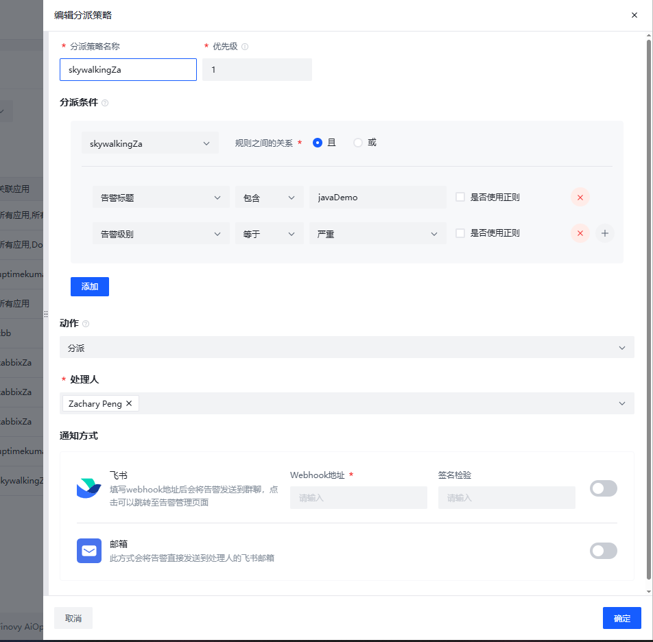

#### 举例说明
如：

+ 分派条件选择多个应用：
    - 应用之间是或的关系，即告警数据的告警源满足其中一个应用数据及分派条件规则满足，即会被分派
+ 分派条件规则关系：
    - 且：规则必须同时满足条件
    - 或：规则满足其中一条条件即可
+ 动作选择：
    - 分派：正常分派，分派给处理人
    - 忽略：落库分派，自动关闭，忽略通知
+ 选择处理人：
    - 处理人可选择用户组、用户，可以多选，会自动汇总用户组绑定用户及所选用户，以轮询的方式选择处理人，即一条告警只会由一个处理人处理

#### <font style="color:rgb(44, 44, 54);">通知方式</font>
+ 飞书通知：通过编写飞书群组机器人的Webhook地址和签名校验，告警会发送到所配置群组上。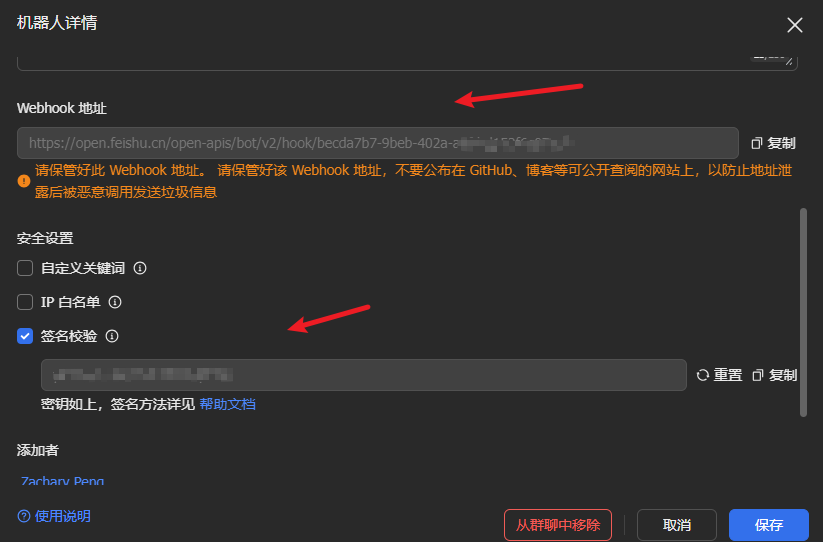
+ 邮箱通知：开启邮箱通知，产生告警时会发送告警通知到对应解决人邮箱。
+ 语音通知：开启语音通知，产生告警时会拨打对应解决人电话，达到通知效果。
+ WebHook通知：开启WebHook通知，设置webhook地址，产生告警时会调用webhook地址通知。

```json
POST 方式调用
{
  "alertNoticeUserName": "解决人名称",
  "alertNoticeTitle": "告警标题",
  "alertNoticeLevel": "Error", // Normal：通知；Info：提醒；Warning：警告；Error：严重；Critical：致命
  "alertAppType": "WebHook", // 告警源类型
  "alertNoticeCode": "2CLQesWorhI", // 告警编号
  "alertNoticeContent": "content", // 告警内容
  "alertAppName": "webhookCould", // 告警源名称
  "callbackUrl": "https://aiops.finovy.cn/alert/myAlert?alertNoticeCode=2CLQesWorhI", // 告警地址
  "alertNoticeHost": "告警主机", // 告警主机
  "alertTime": "GMT 2024-10-14 15:06:21.0" // 0时区时间
}
```

### <font style="color:rgb(44, 44, 54);">AI+异常检测</font>
#### 概述
对容易忽略的重复告警，系统定期回归查找每一台主机的历史7天告警数据，统计其各告警级别的重复告警项，如果某些主机的重复告警量较多则标记为异常，传入异常主机的历史7天告警数据到AI让其进行分析，得到解决参考建议进行展示。

#### 开启收集
在资产管理-告警源集成 中开启对应告警源的AI+异常检测开关。

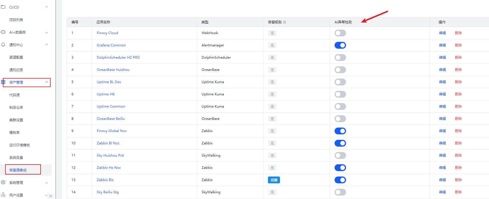

开启了AI异常检测的告警源下的新告警数据会根据规则（统计历史7天内重复告警条数大于等于50的数据）进行AI异常统计并显示在AI+异常检测列表。

