# 快速建立AI+数据库
# 第一步：规则配置
访问 AiOps 系统，点击 **AI+数据库** ->规则配置如下图所示：

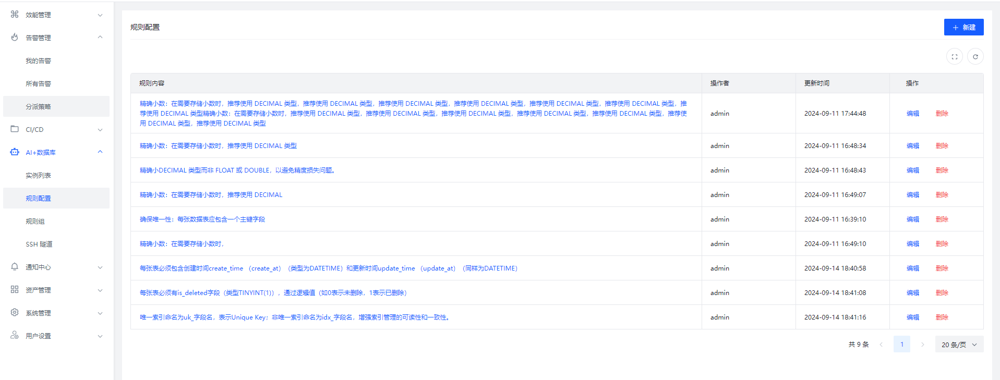

点击新建按照要求自定义规范内容

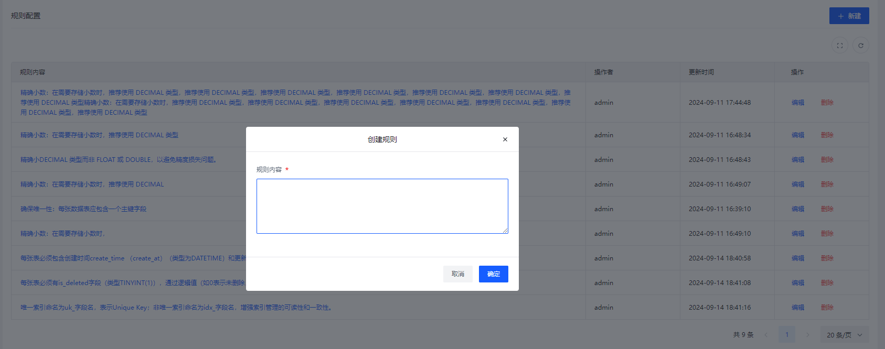

# 第二步：规则组配置
点击规则组创建组把相关的规则组合起来，便于管理和应用。

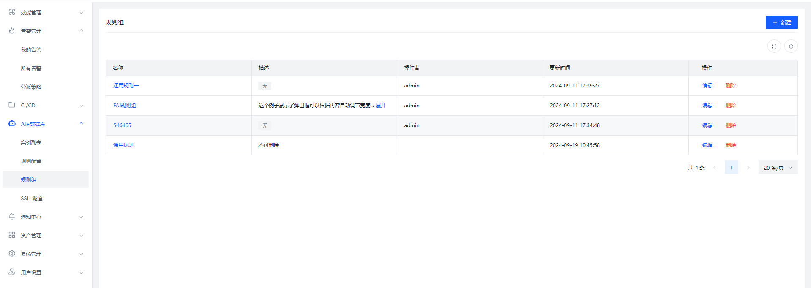

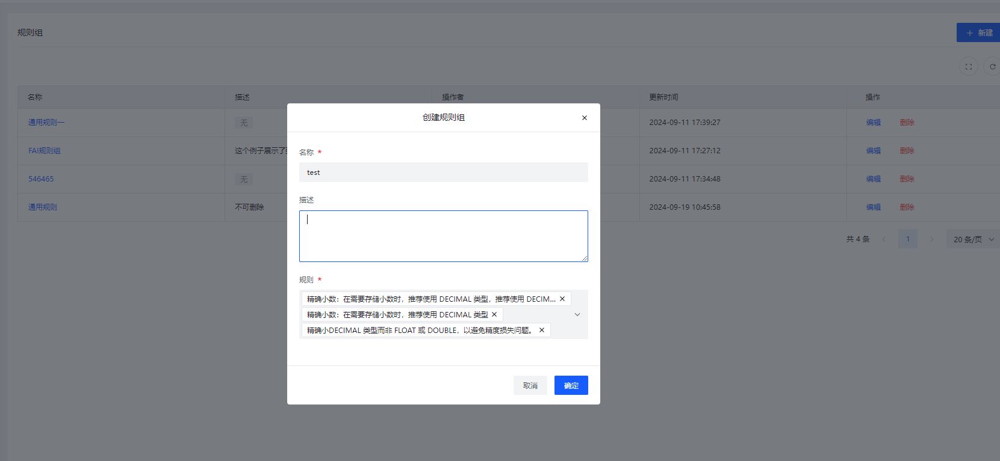

# 第三步：实例配置
点击实例列表创建数据库实例连接，配置完成后点击测试验证。

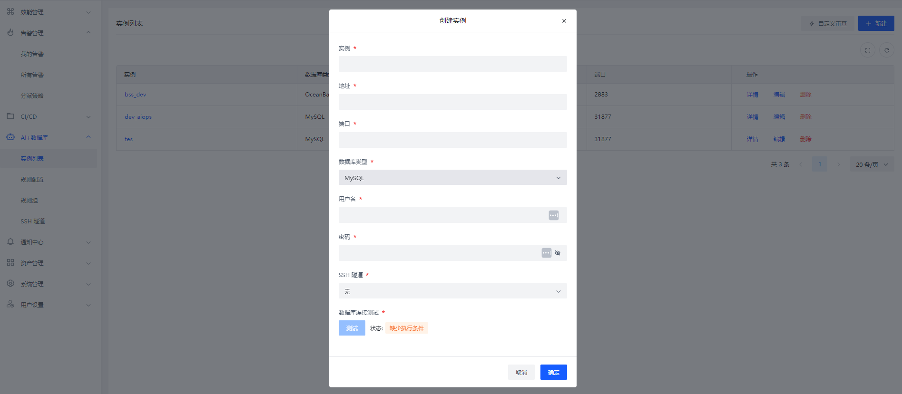

注意事项：

通过隧道连接需提前SSH配置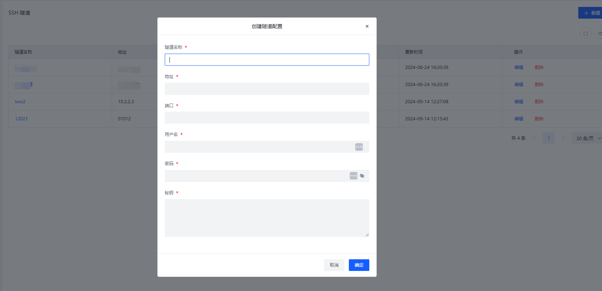

# 第四步：数据库配置
选择实例详情进入，第一次进入会出现缺少数据，需要刷新数据

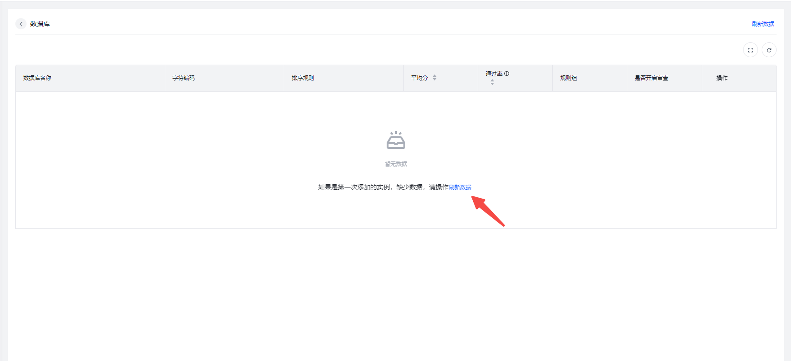

刷新后数据展示如下

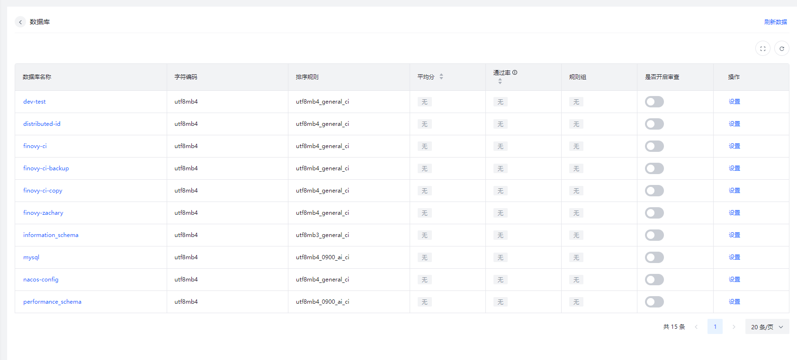

选择数据库设置规则并开启审查，触发方式分为两种人工手动触发可以点击 AI审查，自动触发每天0点触发

说明：

1. 开启审查是执行AI审查的必要条件，未开启的数据库不会触发
2. 已审查过的表在未发生结构变更不会重复审查

实例自动审查每天0点触发

单库审查

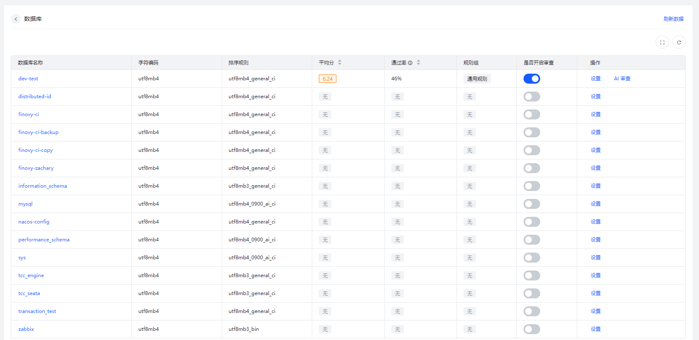

# 第五步：查看审查结果
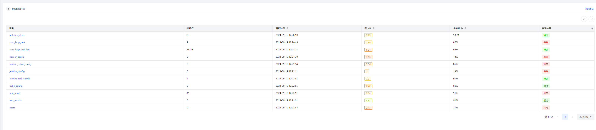

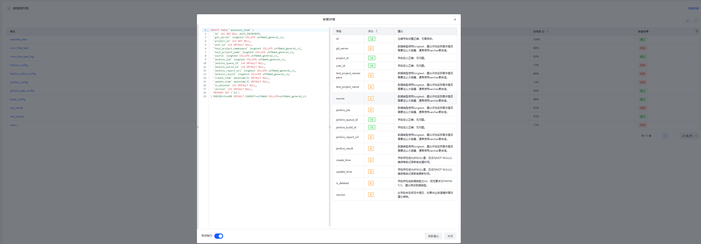

