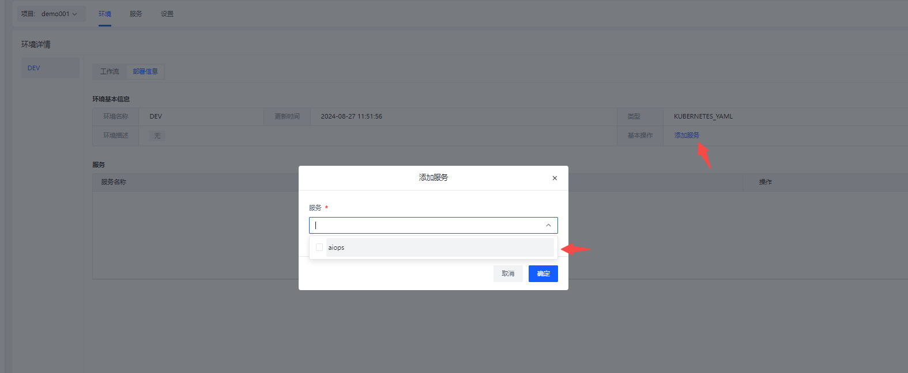

# 快速建立CICD第一个项目
# 准备工作 （管理员操作）
+ 集成代码源  （详情待补充）
+ 集成制品仓库 （详情待补充）
+ k8s集群设置 （详情待补充）
+ 运行环境模板 （详情待补充）

# 第一步：基础配置
访问 AiOps 系统，点击 **CI/CD** -> 新建按钮，创建项目如下图所示：

点击立即新建按钮，进入项目设置

选择项目需要关联的代码群组或者指定项目选中保存

选择项目需要上传的制品仓库选中保存

运行集群设置：项目在kubernetes集群执行工作流程（包含：构建、代码扫描、执行命令）

部署集群设置：服务部署到指定的kubernetes集群

# 第二步：服务配置
自定义服务名称与代码源项目关联

kubernetes服务的YAML关联，配置如何获取？[YAML教程](https://www.yuque.com/isyun/qomiub/bsbgv0x6m40fx36z)

# 第三步：环境配置
点击 环境 -> 环境设置，如下图所示：

按照所需授权制品仓库、集群

# 第四步：环境与服务关联
将服务授权到环境

# 第五步：工作流交付
根据实际需求选择要部署的服务、以及对应的构建分支

# 常见问题
### 新建服务后，在工作流流程设计的具体阶段编辑时没有找到对应的服务名称？

解决方式： 需要在对应环境下添加你的服务

### 构建成功，部署失败报错，一般是YAML配置文件有问题

解决方式： 可以参考已经建好的服务内容，删除一些不必要的字段，k8s的配置对有些字段是不认可的

### 构建还没完成，部署已经成功了？

原因一般是新建工作流时的工作目录不对，需要确定一下gitlab仓库的代码目录。

### 页面构建速度过快，构建和部署都是成功的，但是项目实际并未更新成功

解决方式： 

1. 第一种情况是镜像问题导致，可能是镜像未重新构建或者是镜像名称配置错误
2. 第二种情况是代码目录中没有初始化docker的.env文件

