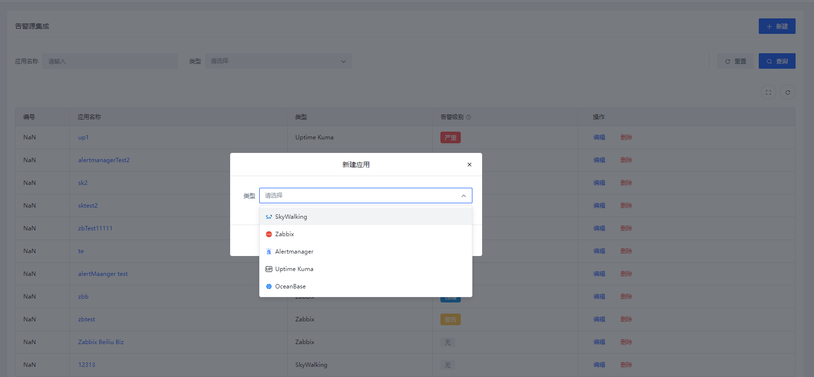
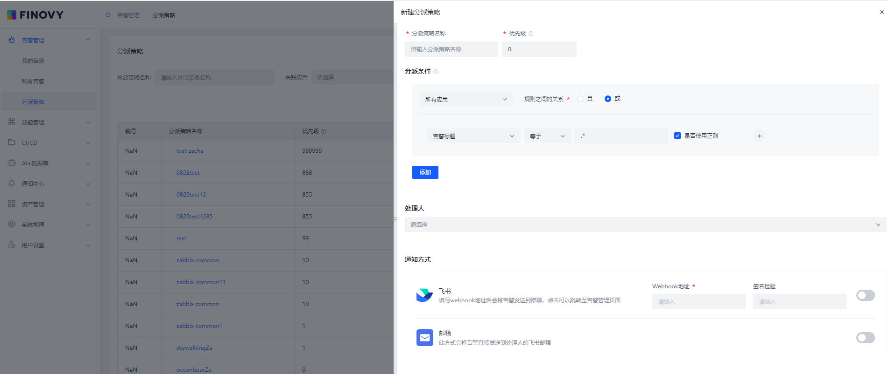

# 快速建立告警管理

## 创建 应用，集成告警

告警源集成

+ [AlertManager](https://www.yuque.com/isyun/qomiub/esbgwguq3ugqpiop)
+ [Zabbix](https://www.yuque.com/isyun/qomiub/olhr7mne717k5iw3)
+ [SkyWalking](https://www.yuque.com/isyun/qomiub/bgvlf1pwgghr7a0z)
+ [Uptime Kuma](https://www.yuque.com/isyun/qomiub/sff2ciq0f0kar0ik)
+ [OceanBase](https://www.yuque.com/isyun/qomiub/panrzdyq5fctngun)

## 创建分派策略、指定处理人、通知方式
分派条件

+ 选择已建应用；
+ 根据告警级别、告警内容设置分派条件。条件支持：等于、不等于、在列表中、不在列表中，均为正则匹配；
+ 支持配置多个且/或条件。

处理人

+ 分派人支持选择人、组协作策略，支持组合添加；

通知方式

+ 

